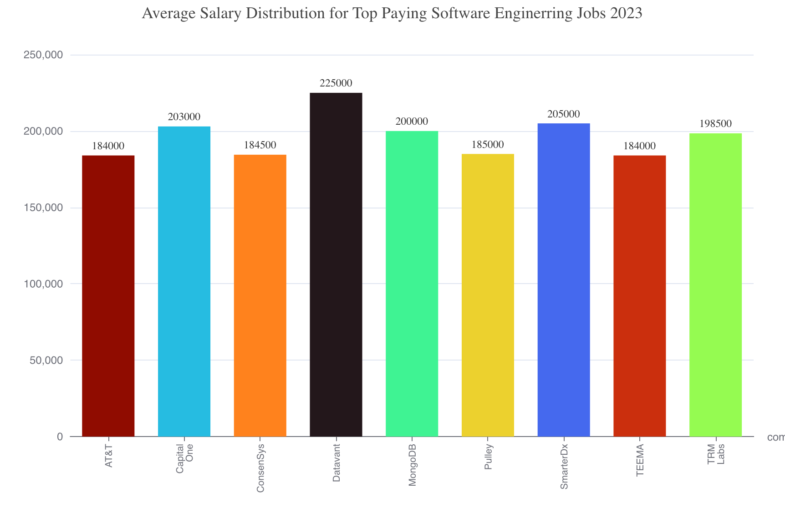
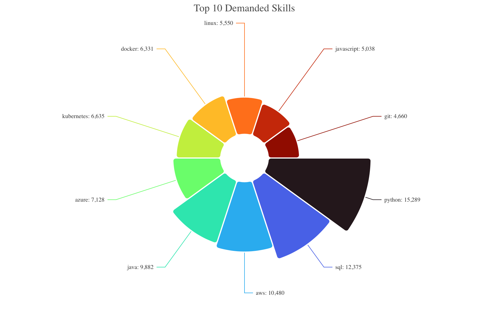

#  Introduction
I Dive into the Software job market! Focusing on Software Engineer roles,
this project explores top-paying jobs, in-demand skills, and where high demand meets high salary in Software Engineering.

SQL Queries? Check them out here: [project_sql](/project_sql/)
# Background
The tech industry continues to grow rapidly, with Software Engineers among the most sought-after professionals worldwide. 
Companies increasingly look for candidates with expertise in programming, data analysis, and emerging technologies. 
However, not all skills and roles are equal in terms of demand and compensation.

### The questions I wanted to answer through my
SQL queries were:
1. What are the top-paying Software Engineer jobs?
2. What skills are required for these top-paying jobs?
3. What skills are most in demand for Software Engineers?
4. Which skills are associated with higher salaries?
5. What are the most optimal skills to learn?

# Tools I Used
For my deep dive into the Software Engineer job market, I harnessed the power of several key tools:
- **SQL**: The backbone of my analysis, allowing me to query the database and unearth critical insights.
- **PostgreSQL**: The chosen database management system, ideal for handling the job posting data.
- **Visual Studio Code**: My go-to for database management and executing SQL queries.
- **Git & GitHub**: Essential for version control and sharing my SQL scripts and analysis, ensuring collaboration and project tracking.
  
# The Analysis

## Top Paying Roles
To identify the highest-paying roles, I filtered Software positions by average yearly salary and location. This query highlights the high paying opportunities in the field.

```SQL
SELECT 
    job_id,
    job_title,
    job_location,
    job_schedule_type,
    salary_year_avg,
    job_posted_date,
    company_dim.name AS company_name
FROM
    job_postings_fact
LEFT JOIN company_dim ON company_dim.company_id = job_postings_fact.company_id
WHERE job_title LIKE '%Software%' AND
      job_location = 'Anywhere' AND
      salary_year_avg IS NOT NULL
ORDER BY salary_year_avg DESC
LIMIT 10;
```



Here's the breakdown of the top Software Engineer jobs in 2023:
- **Wide Salary Range:** Top 10 paying Software Engineering roles span from $184,000 to $225,000, indicating significant salary potential in the field.
- **Diverse Employers** Companies like Datavant,MongoDB, and Capital One are among those offering high salaries,showing a broad interest across different industries.
- **Job Title Variety:** There's a high diversity in job titles, from software engineering and data-related fields, reflecting varied roles and specializations within data.

## Top In-demand Skills


```SQL
WITH top_paying_jobs AS (
    SELECT 
        job_id,
        job_title,
        salary_year_avg,
        company_dim.name AS company_name
    FROM
        job_postings_fact
    LEFT JOIN company_dim ON company_dim.company_id = job_postings_fact.company_id
    WHERE job_title LIKE '%Software%' AND
        job_location = 'Anywhere' AND
        salary_year_avg IS NOT NULL
    ORDER BY salary_year_avg DESC
    LIMIT 10
)

SELECT top_paying_jobs.*,
        skills
FROM top_paying_jobs
INNER JOIN skills_job_dim ON top_paying_jobs.job_id = skills_job_dim.job_id
INNER JOIN skills_dim ON skills_job_dim.skill_id = skills_dim.skill_id
ORDER BY salary_year_avg DESC
```



# What I learned
# Conclusions
