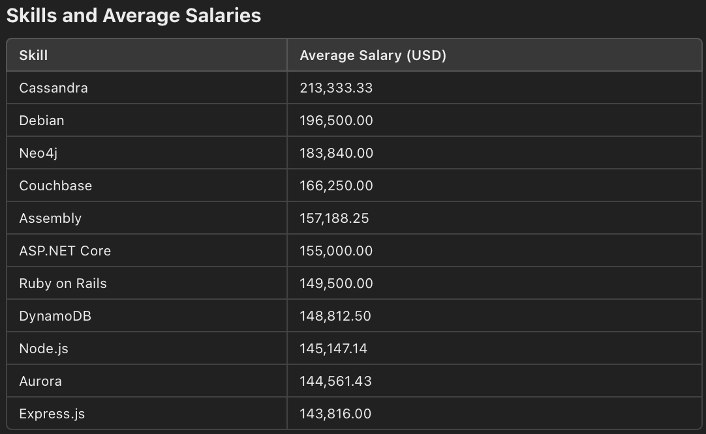
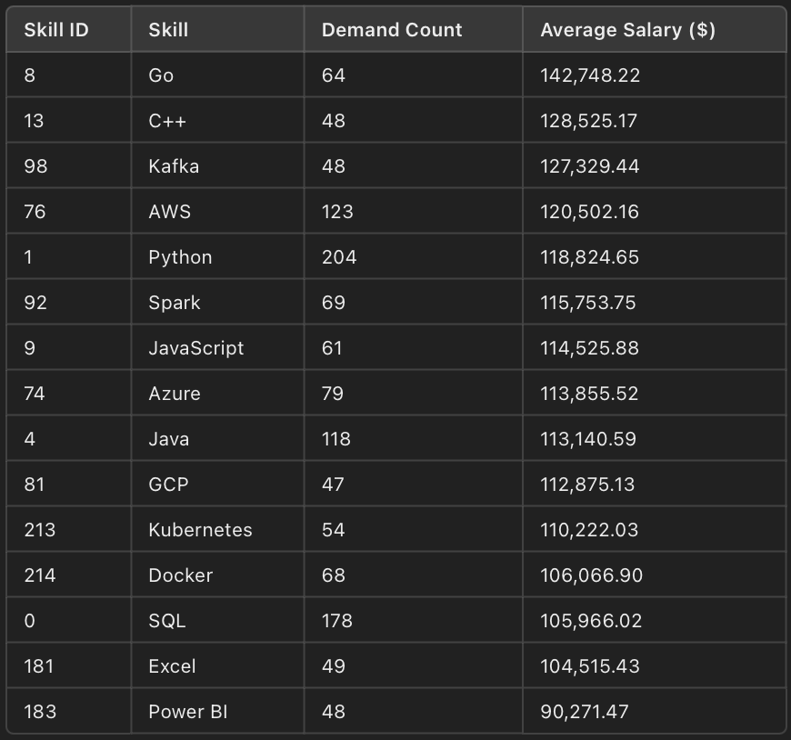

#  Introduction
I Dive into the Software job market! Focusing on Software Engineer roles,
this project explores top-paying jobs, in-demand skills, and where high demand meets high salary in Software Engineering.

SQL Queries? Check them out here: [project_sql](/project_sql/)
# Background
The tech industry continues to grow rapidly, with Software Engineers among the most sought-after professionals worldwide. 
Companies increasingly look for candidates with expertise in programming, data analysis, and emerging technologies. 
However, not all skills and roles are equal in terms of demand and compensation.

### The questions I wanted to answer through my
SQL queries were:
1. What are the top-paying Software Engineer jobs?
2. What skills are required for these top-paying jobs?
3. What skills are most in demand for Software Engineers?
4. Which skills are associated with higher salaries?
5. What are the most optimal skills to learn?

# Tools I Used
For my deep dive into the Software Engineer job market, I harnessed the power of several key tools:
- **SQL**: The backbone of my analysis, allowing me to query the database and unearth critical insights.
- **PostgreSQL**: The chosen database management system, ideal for handling the job posting data.
- **Visual Studio Code**: My go-to for database management and executing SQL queries.
- **Git & GitHub**: Essential for version control and sharing my SQL scripts and analysis, ensuring collaboration and project tracking.
  
# The Analysis

## Top Paying Roles
To identify the highest-paying roles, I filtered Software positions by average yearly salary and location. This query highlights the high paying opportunities in the field.

```SQL
SELECT 
    job_id,
    job_title,
    job_location,
    job_schedule_type,
    salary_year_avg,
    job_posted_date,
    company_dim.name AS company_name
FROM
    job_postings_fact
LEFT JOIN company_dim ON company_dim.company_id = job_postings_fact.company_id
WHERE job_title LIKE '%Software%' AND
      job_location = 'Anywhere' AND
      salary_year_avg IS NOT NULL
ORDER BY salary_year_avg DESC
LIMIT 10;
```
Here's the breakdown of the top Software Engineer jobs in 2023:
- **Wide Salary Range:** Top 10 paying Software Engineering roles span from $184,000 to $225,000, indicating significant salary potential in the field.
- **Diverse Employers** Companies like Datavant,MongoDB, and Capital One are among those offering high salaries,showing a broad interest across different industries.
- **Job Title Variety:** There's a high diversity in job titles, from software engineering and data-related fields, reflecting varied roles and specializations within data.


*Bar graph visualizing the salary for the top 10 salarigs for data analysts; ChatGPT generated this graph from my SQL query.*

## Top In-demand Skills
This query aims to identify the top 10 most in-demand skills for software-related jobs by counting how frequently each skill appears across job postings.

```SQL
SELECT
    skills,
    COUNT (skills_job_dim.job_id) AS demand_count
FROM 
    job_postings_fact
INNER JOIN skills_job_dim ON job_postings_fact. job_id = skills_job_dim.job_id
INNER JOIN skills_dim ON skills_job_dim.skill_id = skills_dim.skill_id
WHERE job_title_short LIKE '%Software%'
GROUP BY
    skills
ORDER BY
    demand_count DESC
LIMIT 10
```

Here's the breakdown of the most in demand skills for a Software Engineer in 2023:
- Programming languages like **Python**, **Java**, and **JavaScript** remain fundamental, while cloud platforms and containerization tools (AWS, Azure, Kubernetes, Docker) are becoming increasingly vital in the industry.


## Skills Based on Salary
Exploring the average salaries associated with different skills revealed which skillsare the highest paying.

```SQL
SELECT
    skills,
    ROUND(AVG(salary_year_avg), 2) avg_salary
FROM 
    job_postings_fact
INNER JOIN skills_job_dim ON job_postings_fact. job_id = skills_job_dim.job_id
INNER JOIN skills_dim ON skills_job_dim.skill_id = skills_dim.skill_id
WHERE job_title_short LIKE '%Software%' AND
    salary_year_avg IS NOT NULL
GROUP BY
    skills
ORDER BY
    avg_salary DESC
LIMIT 30
```

Here's the breakdown of the top paying skills for a Software Engineer in 2023:
- **Top-Paying Skills:** Specialized databases like **Cassandra ($213,333)** and **Neo4j ($183,840)** lead due to their niche demand.
- **Frameworks:** Competitive salaries for **ASP.NET Core ($155,000)** and **Ruby on Rails ($149,500)**; slightly lower for widely used tools like **Express.js ($143,816)**.
- **Languages:** Specialized languages like **Assembly ($157,188)** command premium pay.
- **Infrastructure:** Skills in **Debian ($196,500)** reflect high demand in server management.
- **Overall:** Salaries correlate with demand and specialization, with databases and infrastructure expertise leading the way.



* Table of the average salary of the top 10 paying skills for Software Engineer *

  

## Most Optimal Skill to Learn
Combining insights from demand and salary data, this query aimed to pinpoint skills that are both in high demand and have high salaries, offering a strategic focus for skill.

```SQL
SELECT 
    skills_demand.skill_id,
    skills_demand.skills,
    demand_count,
    avg_salary
FROM
    skills_demand
INNER JOIN average_salary 
    ON skills_demand.skill_id = average_salary.skill_id
WHERE demand_count > 40
ORDER BY
    avg_salary DESC,
    demand_count DESC
LIMIT 25;
```


* Table of the most optimal skill for a Software Engineer sorted by salary.

Here's the breakdown of the most optimal skill for a Software Engineer in 2023:

1. **Python**
- **Demand: Highest** (204 demand count).
- **Average Salary:** $118,824.65.

  **Why Learn It?**
  - Python is highly versatile, with applications in data science, web development, AI, machine learning, and automation.
  - It is beginner-friendly and widely adopted across industries, ensuring strong career prospects.

2. **AWS (Amazon Web Services)**
- **Demand:** High (123 demand count).
- **Average Salary:** $120,502.16

  **Why Learn It?**
  - Cloud computing is rapidly growing, and AWS dominates the market share.
  - Learning AWS equips you with skills for high-demand roles in cloud infrastructure and DevOps.

3. **SQL**
- **Demand:** Very high (178 demand count).
- **Average Salary:** $105,966.02

  **Why Learn It?**
  - SQL remains a fundamental skill for managing and querying databases.
  - It is essential in fields like data analysis, business intelligence, and backend development, making it a versatile tool for multiple industries.

# What I learned
This journey has been a transformative deep dive into SQL, equipping me with powerful data analysis techniques and problem-solving skills. Here are my key takeaways:

- **Complex Query Crafting:**
  I mastered advanced SQL techniques, seamlessly joining tables and using `WITH` clauses to create temporary tables, allowing me to break down complex problems with precision.

- **Data Aggregation:**
  I honed my skills with `GROUP BY`, leveraging aggregate functions like `COUNT()` and `AVG()` to summarize and extract meaningful patterns from large datasets.

- **Analytical Wizardry:**
  I developed real-world problem-solving expertise, turning vague questions into actionable and insightful SQL queries, bridging the gap between raw data and strategic decisions.
# Conclusions

### Insight

1. **Top-Paying Roles:**
Software Engineering offers tremendous salary potential, with specialized roles like **Senior Software Engineer** and **Lead Data Engineer** commanding average salaries upwards of $200,000. Employers such as **Capital One**, **MongoDB**, and **Datavant** stand out for their competitive pay structures.

2. **In-Demand Skills:**
Programming languages like **Python**, **Java**, and **JavaScript** remain foundational, while tools like **AWS**, **Docker**, and **Kubernetes** reflect the growing demand for cloud computing and DevOps expertise. These skills represent the evolving landscape of modern software engineering.

3. **Skills vs. Salary:**
Specialized skills such as **Cassandra**, **Neo4j**, and **Debian** demonstrate a clear correlation between niche expertise and high compensation. However, widely used skills like **Python** and **AWS** strike a balance between demand and competitive pay, making them optimal choices for aspiring software professionals.

4. **Optimal Skills to Learn:**
Combining demand and salary data, skills like **Python**, **AWS**, and **SQL** emerge as the most strategic to learn for a thriving career in software engineering. They are versatile, highly demanded, and provide strong earning potential.

### Closing Thoughts
This project has been an eye-opening exploration of the software job market. Through SQL queries and data analysis, I’ve gained valuable insights into what the industry values most in terms of skills and expertise.

1. Focusing on high-demand skills like Python, AWS, and SQL is a smart strategy for long-term success. 
2. For those aiming for higher salaries, exploring specialized tools and technologies such as Neo4j, Cassandra, and Debian could open doors to premium opportunities.
3. Staying adaptable and continuously learning is key in an industry that evolves so rapidly.
